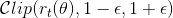
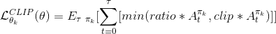

# Reacher Report

Version 2 of reacher with 20 agents.

At first i tried to solve the environment with a DDPG agent. Funnily enough, initially i didn't get any rewards. Which was due to not using any exploration noise (Thats the thing about acting deterministically! No stochasticity, no exploration). However even after i fixed that, i found DDPG to be extremely unreliable in performance. Even with regards to simple environments like MountainCarContinuous and Pendulum. I was further disheartened by the fact that when i checked other people's implementations of DDPG, they were ALSO extremely unreliable in performance. Sometimes failing to learn at all. From reading the paper on D4PG, this seems like the necessary improvement on the algorithm, but also would take some time to implement myself, since i hadn't implemented the C51 distributional DQN algorithm in the previous project.

One thing that became very obvious to me, is just how important the hyperparameters are. During my quest for DDPG heaven, i found a lot of github 'solutions' that failed to work on their default parameters. Or failed to run without errors. I throughly appreciate the reviewer's job on these projects now :) And keeping code clean and modulurized which i am guilty of fudging as well. All this is to say that i discarded the DDPG agent in favor of PPO.

The PPO model itself is deceptively simple:

1. Collect trajectories
2. calculate the returns and Generalized advantage estimates
3. Learn on the samples
   Repeat steps 1-3

Each episode i collect 20 trajectories of size 320, and then run 10 steps of learning on batches of size 640.
With a sliding window of 10, The agent solved the environment in 1560 episodes. With a sliding window of 100 the agent solved the env in 1940 episodes.

I realize it was supposed to solve it within 100 episodes, but that wasn't well defined to my understanding. I can make it solve it in 1 very long episode, or 100 or 1000. Depending on how many trajectories and learning steps i take. So i ended up leaving the name as episode. I also skipped adding a dones mask as the episodes never terminate.

However i managed to make it into quite an ordeal!

Some issues i ran into:
I tried to use both of my GPUs, but since all tensors must be calculated on the same device that runs the policy, 2 seems redundant. I suppose if i had a distributed setup then 2 would work.

Initially kept the shapes of the batches as [batch_size,num_agents], however this means that each agents experience is only trained on by itself and the samples are not shared amongst the others. By flattening the experiences, then they can be shared across all agents.

Strangely i had a hell of a time getting things to learn. I kept running into the same problem where it would appear that everything is fine, but the agent would staunchly refuse to learn. This was the cause of much (so much, oh so much) aggrevation. As debugging RL agents can be really quite difficult. Ultimately i ended up completely reworking calculating the advantages from scratch. As that seemed to be the only possible place where i had screwed things up. In doing so i switched the learning from Advantages to returns which worked well. And then when i reimplimented the GAE function, that worked better. You can clearly see this in the graphs, returns is leveling out, advantages is continuing up in more or less a straight line.

During the course of the agent not learning, i learned a lot about the need to modularize your functions so you can unit test them. And i think going forward i will make sure to build the agents in such a way as to be able to test all the algorithms seperately. And in addition be able to test the network's capability to learn on a simplier environment. This last point seems more difficult as it requires the flexibility to be able to handle many environments. But from my last experience it would have been oh so worth it!

## The Algorithm

**Overview**
PPO is an online (learns on the current policy) actor+critic method. It gathers trajectories in the environment, stores them and then looks at the rewards it recorded. Based on the rewards it updates the network some number of times to increase the likelyhood of actions that are associated with positive returns, and decrease likelyhood of negative returns. In updating the network, it uses a 'surrogate' objective function that is a pessimistic calculation of the gradient.

**Details**

1. Gather Trajectories

PPO uses the actor to generate actions in the environment, and store the probability of those actions. Since i'm using a dual head network where the weights are shared, the value of the state is also projected and stored at this time.

2. Calculate future and GAE rewards

After gathering the trajectories, we calculate the discounted future rewards, and Generalized Advantage Estimates (GAE). GAE calculated the cumulative TD error (value of future state + reward - the value of the present state), discounted by gamma\*gae_lambda (for more information visit this page [link](https://danieltakeshi.github.io/2017/04/02/notes-on-the-generalized-advantage-estimation-paper/ "Generalized Advantage Estimation")). Those are then passed to the update step, along with the rest of the trajectories gathered.

3. The Update:

_The Actor_
Now we take the old action log probabilities and take e to the difference between the new log probs and the old ones. This means on the first step e^0 = a ratio of 1. And as the log probs diverge over the course of the updates, goes slightly up or down. The size of the ratio is clipped between +/- epsilon (usually ~0.2).

Becuase we are training on policy, we must account for the difference between our current network and the previous one which gathered the trajectories, this ratio gives us a way to scale the reward based on the new likelyhood of us choosing the same actions with our current network. So we scale the advantages with the ratio and the clipped ratio, and take the min.

This is our loss. We then perform gradient ascent on the gradient of the loss to update our actor network.

_The Critic_
The critic loss is simply the Mean Squared Error (MSE) of the discounted future rewards and the projected values. And the network is updated according to the gradient of that loss. In the current case, i'm using the pytorch.smoothL1loss, which means MSE for loss under 1 and otherwise L1. Which penalizes large weights, thus encouraging the updates to be small. Which is necessary to maintain the continuity between past and present networks, otherwise things can spiral out of control.

## Questions

1. There also technically should be the VF coefficient for when you use a dual head network. However it seems to train fine without?
2. Its also a little unclear why normalizing the rewards helps. When combined with future rewards, this makes the beginning rewards negative and later rewards positive. Which seems like it should result in destablizing the learning algorithm since the beginning actions will always be penalized (and the reverse for later actions).
3. Also there is no gif of the agent because the watch_agent doesn't work well for some reason (i'm on Ubuntu 18.04 which might be the issue) and results in a laughably small screen which cannot be resized(???).

## Experiments:

**Hypergradient Adam**
I also tried training with AdamHD, which sped up initial training significantly as noted in their paper. But later the training was more unreliable and ultimately did not lead to a speedup. They mention that this can be side stepped by decaying the lr to converge to a fixed number.

**Returns vs Advantages**
Without advantages the agent solved Reacher in 1630-3k steps.
With advantages the agent solved Reacher in 1560 steps.

- _Solving the Environment with advantages_

- _Solving the Environment with returns_

**batch non-continuity**
I experimented with non-continuity in the batches. So instead of getting a sequence, get a series of random spots. I assumed this would improve performance because it might reduce the bias of how it has been behaving. However in my small sample size it took longer to converge. This is probably because it is necessary to learn sequences to get the arm to the goal. The goal is solved normally in 68 minutes. And without sequences it was solved in ~2x that time.

**Model weight initialization**
I tried using the ddpg weight initialization, because while extensively debugging the program i noticed that the state value outputs were often quite large (either pos or neg). And given that the rewards are quite small (0.1), it will usually be way off on the value function. So i thought it might make sense to initialize the network with very small weights to cap the value projections. This changed the initial projected state values from +/-3 to 6 to +/-0.1. This seemed to materially effect the speed of convergence, although to accurately get the true signal i would have to run more experiments. In the same vein i thought about scaling the reward which i mention down below in Future Work.

## Hyperparams:

Hyperparams are all loaded from the config.py file

| Parameter     | Value  | Description                                                |
| ------------- | ------ | ---------------------------------------------------------- |
| SGD_epoch     | 10     | Number of training epoch per iteration                     |
| Batch size    | 32\*20 | batch size updated for all agents                          |
| tmax          | 320    | Number of steps per trajectory                             |
| Gamma         | 0.99   | Discount rate                                              |
| Epsilon       | 0.2    | Ratio used to clip r = new_probs/old_probs during training |
| Gradient clip | 10.0   | Maximum gradient norm                                      |
| Learning rate | 1e-4   | Learning rate                                              |
| Beta          | 0.01   | Entropy coefficient                                        |
| gae_lambda    | 0.95   | Lambda for Generalized Advantage Estimate                  |

## Future work

One thing i noticed while combing through my program in debug mode, was the the initial state estimates can be quite large (neg or pos). Whereas the rewards are 0.1 or 0. Some possible improvements:

- scaling the rewards so that the signal is louder.
- normalizing the state input
- learning rate decay

Attributions:
Udacity, @github - Ostamand (using his hyperparams), ikostrikov, ShangtongZhang, bentrevett
