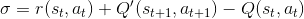

# Tennis Report

Initially i tried to solve the environment with a MADDPG agent. 1st version was with an env_wrapper, multiple envs, multiple agents. Each agent fed only its own local observation, each critic fed all actions and observations. I could not get this to work, i thought perhaps it was due to how i was indexing the agents, at the same time i realized the env_wrapper was not needed so i switched to the next version. 2 agents, No env_wrapper. Also unsuccessful. I played around with PPO for a bit, but realized i needed to do something special with the trajectories, since they will typically be of different lengths. So i can't calculate the advantages in one vectorized go. 

At the end i decided to go back to base case - single DDPG agent.
I found some strange behavior, i've always had poor results with DDPG on my local machine, and i've never been clear on what the problem is, despite many hours of digging through debuggers and code. There seemed to be an issue with loading networks directly from the Critic/Actor class, which was bypassed by passing them through? I can't see how this could be a thing, so its probably just some series of weird coincidences. Nonetheless thats what i'm doing for now, because DDPG is so temperamental that it makes me noticably insane!

I really wanted to separate out the actions and observations into separate agents, but since training on the whole batch actually works this is what i have done. Its clear to me now, that RL requires a very steady hand and clear vision thats thought out before hand. If you start mixing things up, it quickly goes out of control. Unit tests and blueprinting is the future! (Because i do NOT want to repeat the past ;)

(side note, because the environment is collaborative and alternating, you can use the max of the reward for each (s,a,r,s') tuple, which simplifies things down to a single reward)

The DDPG model:

1. Seed Replay Buffer with randomly generate trajectories up to the min buffer size
2. Start training for real
3. Each step, calculate the TD error, store the (s,a,r,s') tuple in the Priority Replay Buffer
4. Learn on the samples
   Repeat steps 3-4 until environment is solved.

With a sliding window of 100 the agent solved the env in 1940 episodes.

## The Algorithm

**Overview**
Deep Deterministic Policy Gradients is an offline (can learn off-policy, because the gradient step is from the critic), actor+critic method. It uses 4 networks, local actor+critic and target actor+critic. The critics are function aproximations of the Q function. Where they take in an action and state and output a value Q(s,a). In this case, they take in the local states from both agents, and actions from both agents, and output values for both agents given the states/actions. The update step is accomplished by taking the difference between our future target critic projections and current local projections which is the Temporal difference error or TD error. 

Each step a (s,a,r,s') tuple is stored in the replay buffer. The target networks are updated each step based on the hyperparameter tau, which copies some fraction of the local networks to the target networks. This is to make the target more stationary, as RL algorithms are often unstable in non-stationary environments. Because DDPG is offline, it can learn from any experience in the environment to improve its own policy. 

To augment the ability of a replay buffer to improve performance, i have added the Priority Replay Buffer. This keeps track of the difference between the expected value of the state, and the actual value of the state, and scales the updates from (s,a,r,s') tuples according to how well the agent 'guessed' the reward. The worse the guess, the bigger the update and vice versa.

The actions at each step are chosen deterministically by the policy according to the state. This simplifies the bellman equation significantly, 

Becomes

By avoiding taking a max over a continuous action space, or descretizing the action space to reduce dimensionality. Because of the deterministic nature, it does not explore by default. Which makes it necessary to add some noise, either to the action itself, or to the parameters generating the action. This also means this is a good strategy if there is always 1 good option, but not if mixed strategies are ideal like in poker for example.

The Priority Experience Replay:
Records the TD

**Details**

1. Priority Experience Replay (PER)

In order to add an experience tuple (s,a,r,s') to the buffer, we must calculate the TD error. The priority of the tuple is  

where

When alpha is 0, all experiences are treated equally. when alpha is 1, all experiences are treated exactly according to the TD_error. (epsilon is added to account for when the TD_error is zero or near zero). We normalize the priorities by the sum of all the priorities. Then we calculate an importance feature to determine the weight of the update. The importance of a given tuple is the (priority * self.buffer_size)**-self.beta. The beta hyperparameter is to account for the fact that we are skewing the distribution of experiences by modifying the size of the update from each experience. To ameliorate this bias by the using importance sampling weights

We then normalize that by 1 / the max importance weight of any tuple so that it is always a number between 0 and 1 and scales the update downward to keep things stable. 

2. Acting with noise

**Action noise:**
We forward pass through the network and then add some noise (Gaussian or Orstein-Uhlenbeck) to the action. This causes a wide variety of actions despite the deterministic policy.

*TODO*
**Parameter noise:**
We add adaptive noise to each layer of the network. This is tricky because noise will effect each layer differently. This has been demonstrated to be generally superior to action noise. Logically this makes sense as action noise, gives an unexpected outcome to the agent, its primary reason is for exploration so that the agent can see a wide variety of actions and update towards that. Whereas parameter noise means, the agents weights themselves produced the action. It brings to mind if you were trying to play a video game and your actions were noisy it would be super frustrating, and might as well be observing someone else playing the game. But if the controller kept changing, you might still be learning about the connections between each controller configuration and the actions, as well as what the actions do within the environment.

The noise is adaptive according to the distance between the perturbed agent and the local agent actions. Which means they only differ by as much as the std allows. This requires recording the actions of the perturbed agent and local agent.

3. The learning step:

_The Critic_
Is updated according to the mse of (TD_error * PER importance weights weights)

Which corresponds to minimizing the TD error between our current state action value pair, and future state action value pair. Which over time will lead us to update towards the actual return. 

_The Actor_
Is updated according to the the minus mean value the local critic Q of (states,actions). Which means we taking the gradient with respect to maximizing the Q(states,actions) value.

This is our loss. We then perform gradient ascent on the gradient of the loss to update our actor network.

## Experiments:

I trained initially with a large replay buffer. But progress was slow. I realized i should reduce the replay size significantly because; One, old memories don't offer that much in this environment, training on initial ball misses is not that useful over time. Two, speed of processing, as my version of PER bogs down with a large amount of intermediate nodes. I think this is due to the way i calculate the priority sum. I immediately saw the difference in speed of learning. There is a trade off in terms of variance, the smaller the buffer, the noisier the results. For example, with a replay size of 1000000, at 1:10 it was still at a mean of ~0.25. Whereas with a replay size of 10,000 it solved the environment in 20 minutes. This is also due to PER being able to extract the relevant information out of stored replays better than a vanilla replay buffer. 

## Questions

1. My biggest question is also retorical, "WHY do i have such a hard time training DDPG???" I think the answer will be just writing it from scratch again and again, and the added some of the additional updates to the algorithm which will improve performance so i can tell more quickly when it is learning or not.
2. The MADDPG paper mentions training a separate network to model the behavior of other agents. This sounded really interesting, but the Udacity version did not do this as far as i can tell. I guess this is optional?

## Hyperparams:

Hyperparams are all loaded from the config.py file

| Parameter     | Value  | Description                                                |
| ------------- | ------ | ---------------------------------------------------------- |
| SGD_epoch     | 1     | Number of training epoch per iteration                     |
| tmax          | 2e+3    | Number of steps per trajectory (in reality its ~15 at the beginning and 50+ later)                            |
| Gamma         | 0.99   | Discount rate                                              |
| Learning rate | 1e-3   | Critic Learning rate                                       |
| Learning rate | 1e-4   | Actor Learning rate                                       |
| Batch size    | 256 | PER batch size                          |
| Replay size    | 1e6 | PER replay size                          |
| min buffer size   | 1e4 | PER min buffer size                          |
| Beta          | 0.5   | PER hyperparam                                        |
| Beta duration | 1e+5   | PER hyperparam                                        |
| Alpha          | 0.6   | PER priority                                        |

## Future work

One thing i noticed while combing through my program in debug mode, was the the initial state estimates can be quite large (neg or pos). Whereas the rewards are 0.1 or 0. Some possible improvements:

- D4PG
- MADDPG
- normalizing the state input
- learning rate decay
- Selective training on only a few states? Most of the experience at the beginning is meaningless. The most important moments are the end states and the reward states. Possibly combining those two only at the start would bootstrap quickly. However long term it must be able to connect the dots inbetween rewards and end states.

Attributions:
Udacity, @github - Ostamand
